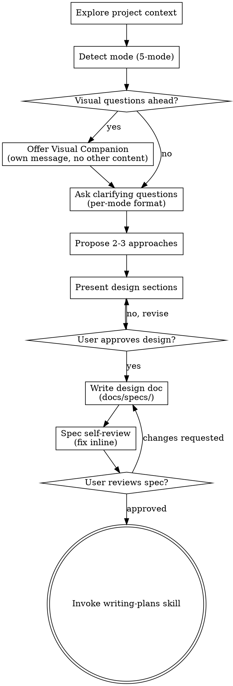

# Brainstorming Ideas Into Designs

> 🌱 **ShiningPlague-adopted.** Originally obra/superpowers; battle-tested on a shipped Godot project. Original behavior preserved + project conventions layered on top.

Help turn ideas into fully formed designs and specs through natural collaborative dialogue.

Start by understanding the current project context, then ask questions one at a time to refine the idea. Once you understand what you're building, present the design and get user approval.

<HARD-GATE>
Do NOT invoke any implementation skill, write any code, scaffold any project, or take any implementation action until you have presented a design and the user has approved it. This applies to EVERY project regardless of perceived simplicity.
</HARD-GATE>

> **If an artifact named here is absent:** say so plainly in one line, skip that step, and
> continue. Never invent the file to satisfy a checklist, and never fail a close because an
> optional artifact was never created.

## Anti-Pattern: "This Is Too Simple To Need A Design"

Every project goes through this process. A todo list, a single-function utility, a config change — all of them. "Simple" projects are where unexamined assumptions cause the most wasted work. The design can be short (a few sentences for truly simple projects), but you MUST present it and get approval.

---

## Brainstorming modes (5-mode framework — ShiningPlague addition)

The original obra/superpowers brainstorming skill is **single-mode** (linear A/B/C Q-by-Q + vote). ShiningPlague adds **5 explicit modes** with auto-detection. The assistant picks the mode at brainstorm start based on language cues from the designer's first message; designer can override with bracket-syntax (e.g. `[OPEN]`) to force a mode.

Source: WeWork 2022 "10 effective brainstorming techniques for teams" mapped onto our solo-dev + 49-agent context (multi-agent dispatch is our analog for team brainstorm — brainwriting becomes parallel-agent dispatch; figure storming becomes agent-as-figure; round-robin becomes director POV briefs).

### Mode taxonomy

| Mode | Purpose | Output shape | Source technique (WeWork 2022) |
|---|---|---|---|
| **OPEN** | Divergent — generate wide, no critique | Bullet list of raw ideas, no votes yet | Brainwriting + rapid ideation + brain netting |
| **CLOSED** | Convergent — narrow, vote, lock | Current Q-by-Q A/B/C+vote pattern | (project default + step-ladder critique) |
| **FOCUSED** | Improve existing artifact, not invent new | Delta list against anchor (file/spec/system) | Eidetic image + mind mapping |
| **PERSPECTIVE** | Stress-test from non-obvious angle | Critique report + integration plan | Figure storming (agent-as-figure) |
| **STRUCTURED** | Decomposition / coverage-check | 6-W map (who/what/when/where/why/how) | Starbursting |

### Auto-detection rules (the assistant picks at brainstorm start)

| Designer language pattern | Mode fired |
|---|---|
| "brainstorm X", "ideas for Y", "let's think about Z", wide-open topic, no anchor named | OPEN |
| "pick", "which one", "decide", "lock", "A vs B", explicit options on table | CLOSED |
| "improve", "extend", "harden", "what's missing in", names a specific existing artifact | FOCUSED |
| "stress-test", "any flaws", "what would [X] think", "validate", "punch holes in" | PERSPECTIVE |
| "what are all the parts of", "starburst this", "6 W's on", "decompose", coverage-check language | STRUCTURED |
| Can't tell from language | **default OPEN** — safer to start wide |

**Override:** designer may type `[OPEN]`, `[CLOSED]`, `[FOCUSED]`, `[PERSPECTIVE]`, `[STRUCTURED]` in their message to force a mode regardless of language cues. The assistant confirms the override and proceeds in that mode.

### Per-mode protocol

| Mode | Agent-dispatch pattern | Q format | Spec section shape |
|---|---|---|---|
| OPEN | Parallel dispatch — same prompt to 3+ specialist agents (different POVs), gather raw output, synthesize without critique | No A/B/C yet — raw idea capture; "what would you generate here?" | Bullet list of all ideas + thematic clusters; selection deferred to a follow-up CLOSED mode |
| CLOSED | Mostly assistant-led; single agent if a Q needs deep specialist expertise | Per-Q outcome-first → A/B/C/D options → My vote → Designer decision (existing project default) | Locked decisions table with rationale per Q (existing project shape) |
| FOCUSED | Read anchor artifact first; dispatch 1 agent for delta proposals bound by anchor's existing shape | Q-by-Q on deltas only (not new from scratch) | Delta list with before/after per change; anchor's structure preserved |
| PERSPECTIVE | Dispatch 1+ agents in "figure" role — project specialist OR fictional figure (e.g. game-designer in role-of "Steam reviewer who hates AI", or narrative-director as "Heath bros critique") | Critique-format prompts addressed to figure | Critique report + integration plan (which critiques to honour, which to dismiss) |
| STRUCTURED | Single agent runs 6-W starburst on target idea/system | Who / What / When / Where / Why / How questions, each answered separately | Decomposition map + coverage gaps highlighted |

### Mode transition rules

- Brainstorms naturally arc **OPEN → CLOSED**. The assistant announces the transition explicitly: *"Switching to CLOSED — locking these 3 ideas via Q-by-Q."*
- **Mid-brainstorm mode switch allowed** when stuck (e.g. CLOSED hits a stuck Q → PERSPECTIVE fires to break anchor → back to CLOSED).
- The assistant **announces every transition** before it happens. Designer can override (`"stay in OPEN"` / `"force CLOSED now"` / bracket-syntax).
- Default arc for a single chat: OPEN → CLOSED with optional PERSPECTIVE detour. FOCUSED + STRUCTURED are usually their own dedicated sessions.

### When to use each mode (decision examples)

| Designer says... | Mode | Why |
|---|---|---|
| "let's brainstorm narrative pillars" | OPEN | Wide ideation, no anchor, designer wants exploration |
| "pick between A or B for lock file schema" | CLOSED | Options on table, decision needed |
| "harden the META workflow — what's missing?" | FOCUSED | Existing artifact (META workflow) + improvement language |
| "would a Steam reviewer hate this?" | PERSPECTIVE | Figure-storming prompt |
| "what are all the parts of a complete game-concept doc?" | STRUCTURED | Coverage-check decomposition |
| (ambiguous wide prompt) | **default OPEN** | Safer to start wide than to mis-narrow |

### Common rationalisations (close these loopholes)

| Rationalisation | Reality |
|---|---|
| "The prompt is ambiguous, just default to CLOSED" | No — default is OPEN. CLOSED prematurely narrows. |
| "I'll skip the mode-detection step and go straight to Qs" | Mode-detection is a 5-second self-check before Q1. Don't skip. |
| "OPEN mode is too expensive (3+ agents dispatched)" | Token cost is fine; mis-narrowing costs more. Dispatch wide. |
| "Designer said brainstorm, that means CLOSED by default" | No — brainstorm with no anchor = OPEN. With anchor + options = CLOSED. |
| "Mode transition is too much ceremony" | Announce + proceed = one sentence. Drift without announce = anchoring effect. |

---

## Checklist

You MUST create a task for each of these items and complete them in order:

1. **Explore project context** — check files, docs, recent commits
2. **Detect mode** (5-mode framework above) — at brainstorm start, before Q1
3. **Offer visual companion** (if topic will involve visual questions) — this is its own message, not combined with a clarifying question. See the Visual Companion section below.
4. **Ask clarifying questions** — one at a time, understand purpose/constraints/success criteria. Follow per-mode Q format (CLOSED uses per-Q outcome-first rule below)
5. **Propose 2-3 approaches** — with trade-offs and your recommendation
6. **Present design** — in sections scaled to their complexity, get user approval after each section
7. **Write design doc** — save to `docs/specs/YYYY-MM-DD-<topic>-design.md` (project path — not the upstream superpowers spec folder) and commit
8. **Spec self-review** — quick inline check for placeholders, contradictions, ambiguity, scope (see below)
9. **User reviews written spec** — ask user to review the spec file before proceeding
10. **Transition to implementation** — invoke writing-plans skill to create implementation plan

## Process Flow



**The terminal state is invoking writing-plans.** Do NOT invoke frontend-design, mcp-builder, or any other implementation skill. The ONLY skill you invoke after brainstorming is writing-plans.

## The Process

**Understanding the idea:**

- Check out the current project state first (files, docs, recent commits)
- Before asking detailed questions, assess scope: if the request describes multiple independent subsystems (e.g., "build a platform with chat, file storage, billing, and analytics"), flag this immediately. Don't spend questions refining details of a project that needs to be decomposed first.
- If the project is too large for a single spec, help the user decompose into sub-projects: what are the independent pieces, how do they relate, what order should they be built? Then brainstorm the first sub-project through the normal design flow. Each sub-project gets its own spec → plan → implementation cycle.
- For appropriately-scoped projects, ask questions one at a time to refine the idea
- Prefer multiple choice questions when possible, but open-ended is fine too
- Only one question per message - if a topic needs more exploration, break it into multiple questions
- Focus on understanding: purpose, constraints, success criteria

**Exploring approaches:**

- Propose 2-3 different approaches with trade-offs
- Present options conversationally with your recommendation and reasoning
- Lead with your recommended option and explain why

**Presenting the design:**

- Once you believe you understand what you're building, present the design
- Scale each section to its complexity: a few sentences if straightforward, up to 200-300 words if nuanced
- Ask after each section whether it looks right so far
- Cover: architecture, components, data flow, error handling, testing
- Be ready to go back and clarify if something doesn't make sense

**Design for isolation and clarity:**

- Break the system into smaller units that each have one clear purpose, communicate through well-defined interfaces, and can be understood and tested independently
- For each unit, you should be able to answer: what does it do, how do you use it, and what does it depend on?
- Can someone understand what a unit does without reading its internals? Can you change the internals without breaking consumers? If not, the boundaries need work.
- Smaller, well-bounded units are also easier for you to work with - you reason better about code you can hold in context at once, and your edits are more reliable when files are focused. When a file grows large, that's often a signal that it's doing too much.

**Working in existing codebases:**

- Explore the current structure before proposing changes. Follow existing patterns.
- Where existing code has problems that affect the work (e.g., a file that's grown too large, unclear boundaries, tangled responsibilities), include targeted improvements as part of the design - the way a good developer improves code they're working in.
- Don't propose unrelated refactoring. Stay focused on what serves the current goal.

---

## Project adaptation — spec conventions (ShiningPlague additions)

### Output location (hard override)

Specs go to **`docs/specs/YYYY-MM-DD-<topic>-design.md`**.

Upstream superpowers writes specs and plans under a `superpowers` doc branch. This studio does not: the spec/plan lifecycle in CLAUDE.md owns those paths. Do not recreate the upstream branch.

### Mandatory spec structure

Every spec written during a brainstorm must open with these headers in order:

```markdown
# <Title>

**Date:** YYYY-MM-DD
**Status:** 🚧 IN PROGRESS | ✅ FINAL | 🗄️ ARCHIVED
**Related ADR:** (if written) docs/adr/NNN-<slug>.md | none yet
**Related plan:** (if written) docs/plans/YYYY-MM-DD-<topic>-plan.md | none yet
```

Then the kickoff-for-next-chat checklist, then **the Expected Outcomes section (mandatory)**, then the rest of the content.

### Mandatory "Expected outcomes" section (written DURING brainstorm, revisited AT SHIP)

Every spec MUST carry an `## Expected outcomes at ship` section that answers *"when this ships, what can the designer do, edit, test — and what does the player see differently?"* — BEFORE architecture detail. This is the Phase 6 checklist at ship time.

Template:

```markdown
## Expected outcomes at ship

### For the designer (editable / testable)
- <new dock X lets you edit Y>
- <new field Z is now author-able on example-enemy JSONs via Editor A>
- <new data file N tunes behaviour B, validated by dock>
- ... (concrete — not "improved flexibility"; say what clicks produce what results)

### For the player (visible in-game)
- <previously broken / missing behaviour now works: X>
- <new mechanic Y appears in combat / map / dialogue / ...>
- <rarity / level / archetype now FEELS different how?>
- ... (concrete — write what a playtester would notice in a 5-minute session)

### What stays the same (explicit scope wall)
- <NOT delivered, parked for Step N / later: list>
- <existing behaviour preserved: list>

### At ship — Phase 6 revisit
Check each bullet above against actual delivered state. Record discrepancies as:
- **Delivered ✅** / **Partial ⚠️** / **Dropped ❌ (reason)** / **Bonus (not promised but shipped)**.
```

The designer reviews this section BEFORE approving the spec to lock. If it's vague ("better combat", "cleaner architecture"), push back — outcomes must be concrete enough for a playtester or editor user to verify.

### Spec lifecycle (log every transition)

| State | When | Registry bookkeeping |
|---|---|---|
| 🚧 IN PROGRESS | First write of the spec | Add to `system_registry.json → documentation_stack.spec_index` with `state: "in_progress"` |
| ✅ FINAL | Design approved + ADR written | Update the `state` field to `"final"` + fill `adr` with the ADR path |
| 🗄️ ARCHIVED | Feature shipped in code | Move file to `docs/z-old/specs/`, update `state: "archived"`, fill `shipped` date + `archive_path` |

The `spec_index` array in `system_registry.json → documentation_stack` is the permanent log — entries stay forever, even after archive.

### Handoff contracts

- **Brainstorm → ADR.** At end of the design phase, fire `architecture-decision` 🟢. Target path: `docs/adr/NNN-<slug>.md`. Use [`docs/adr/TEMPLATE.md`](../../../docs/adr/TEMPLATE.md) — every ADR MUST include the `Live Sources` table.
- **ADR → plan.** After ADR lands, fire `writing-plans` 🟢. Target path: `docs/plans/YYYY-MM-DD-<topic>-plan.md`.
- **Plan → implementation.** Fire `test-driven-development` 🔒 + `godot-engine` 🟢 (bundled). Verify with `verification-before-completion` 🔒 before any "done" claim.
- **Shipment → retirement.** Move spec to `docs/z-old/specs/` + update registry + migrate any pipeline narrative into the ADR's `Implementation notes` section (or into `implementation-status.md` if it's a cross-cutting pattern).

### ADR batching rule

One ADR covers 2–3 related decisions from one design phase. Don't write one ADR per decision. Illustrative example — these filenames are not shipped, they show the shape:
- `001-your-system-schema-and-slots.md` would cover the data schema + the capacity model + the stacking policy for one system.
- `002-your-system-pipeline-and-effects.md` (later) would cover table resolution + effect architecture + the autoload extraction.

### Per-question outcome-first rule (hard-won rule from designer feedback)

**Every brainstorm question in CLOSED mode MUST lead with a plain-English "outcome" statement — what the answer actually changes in the shipped game or in how the designer works — BEFORE the A/B/C options.**

The designer has explicitly pushed back on questions phrased as options-without-purpose. Phrase each Q as:

```
**What we're deciding / what outcome it produces (plain English):**
<one or two sentences — what will look, feel, or work differently depending on the answer>

**Option A — ...** (brief description + trade-off)
**Option B — ...** (brief description + trade-off)
**Option C — ...** (brief description + trade-off)

**My vote: <letter>.** Reason: ...

**Which do you want?**
```

If you catch yourself writing options before you've written the outcome, stop and rewrite the question. The designer is a non-coder — "outcome in plain English" is the only frame that tells them whether the question matters.

### Per-question intended outcomes appendix (in every spec)

When writing the spec at end of brainstorm, carry a **`## Per-question intended outcomes`** appendix near the end of the file. One entry per Q that was asked and resolved, structured as:

```markdown
### Q<n>: <topic>
- **Outcome we were aiming at:** <the plain-English framing used when the Q was asked>
- **Decision:** <A / B / C + one-liner of what that means>
- **Why:** <one-line rationale — designer's reasoning or Claude's vote that was accepted>
- **Touches:** <files / systems / docs this answer affects — e.g. "the your-system autoload signature + the shape of its schema under data/_schemas/">
```

This appendix becomes load-bearing the moment a designer revisits a spec post-lock or changes their mind later — it says which Qs are in play and what they were trying to achieve.

### Deviation protocol — if a locked-in Q answer changes later

The designer may change their mind on a resolved Q. When that happens:

| When the change happens | Fire these skills |
|---|---|
| Mid-brainstorm, before ADR written | Update the spec's Per-question appendix + rerun `/design-review` on the affected sections |
| After ADR accepted, before code lands | Fire `propagate-design-change` 🟢 (scans ADRs + traceability for stale decisions) |
| After feature shipped | Fire `propagate-design-change` AND `consistency-check` (cross-doc drift between GDDs/ADRs/registry) |
| Cross-doc drift of any kind suspected | Fire `consistency-check` on its own |

Announce explicitly to the designer: "Q<n> was previously locked as <old>; changing to <new> — firing <skill> to realign <scope>." Don't silently overwrite a prior decision without the realignment pass.

### Cross-skill awareness

- If the task involves Godot file work, announce `godot-engine` (bundled) will fire at implementation time.
- If the task spawns parallel independent sub-tasks, propose `dispatching-parallel-agents` (bundled) 🟢 at plan time — NOT during brainstorm.
- If the task is a bugfix rather than new design, the 🔒 sequence becomes `systematic-debugging → TDD → verification-before-completion`. Brainstorming is overkill for a reproducible bug — skip to systematic-debugging.

---

## After the Design

**Documentation:**

- Write the validated design (spec) to `docs/specs/YYYY-MM-DD-<topic>-design.md` (project path — not the upstream superpowers spec folder)
- Use elements-of-style:writing-clearly-and-concisely skill if available
- Commit the design document to git

**Spec Self-Review:**
After writing the spec document, look at it with fresh eyes:

1. **Placeholder scan:** Any "TBD", "TODO", incomplete sections, or vague requirements? Fix them.
2. **Internal consistency:** Do any sections contradict each other? Does the architecture match the feature descriptions?
3. **Scope check:** Is this focused enough for a single implementation plan, or does it need decomposition?
4. **Ambiguity check:** Could any requirement be interpreted two different ways? If so, pick one and make it explicit.

Fix any issues inline. No need to re-review — just fix and move on.

**User Review Gate:**
After the spec review loop passes, ask the user to review the written spec before proceeding:

> "Spec written and committed to `<path>`. Please review it and let me know if you want to make any changes before we start writing out the implementation plan."

Wait for the user's response. If they request changes, make them and re-run the spec review loop. Only proceed once the user approves.

**Implementation:**

- Invoke the writing-plans skill to create a detailed implementation plan
- Do NOT invoke any other skill. writing-plans is the next step.

## Key Principles

- **One question at a time** - Don't overwhelm with multiple questions
- **Multiple choice preferred** - Easier to answer than open-ended when possible
- **YAGNI ruthlessly** - Remove unnecessary features from all designs
- **Explore alternatives** - Always propose 2-3 approaches before settling
- **Incremental validation** - Present design, get approval before moving on
- **Be flexible** - Go back and clarify when something doesn't make sense

## Visual Companion

A browser-based companion for showing mockups, diagrams, and visual options during brainstorming. Available as a tool — not a mode. Accepting the companion means it's available for questions that benefit from visual treatment; it does NOT mean every question goes through the browser.

**Offering the companion:** When you anticipate that upcoming questions will involve visual content (mockups, layouts, diagrams), offer it once for consent:
> "Some of what we're working on might be easier to explain if I can show it to you in a web browser. I can put together mockups, diagrams, comparisons, and other visuals as we go. This feature is still new and can be token-intensive. Want to try it? (Requires opening a local URL)"

**This offer MUST be its own message.** Do not combine it with clarifying questions, context summaries, or any other content. The message should contain ONLY the offer above and nothing else. Wait for the user's response before continuing. If they decline, proceed with text-only brainstorming.

**Per-question decision:** Even after the user accepts, decide FOR EACH QUESTION whether to use the browser or the terminal. The test: **would the user understand this better by seeing it than reading it?**

- **Use the browser** for content that IS visual — mockups, wireframes, layout comparisons, architecture diagrams, side-by-side visual designs
- **Use the terminal** for content that is text — requirements questions, conceptual choices, tradeoff lists, A/B/C/D text options, scope decisions

A question about a UI topic is not automatically a visual question. "What does personality mean in this context?" is a conceptual question — use the terminal. "Which wizard layout works better?" is a visual question — use the browser.

If they agree to the companion, read the detailed guide before proceeding:
`.claude/skills/brainstorming/visual-companion.md`

---

## Reference files (project paths)

- Project conventions live in [`CLAUDE.md`](../../../CLAUDE.md) → "Spec / Plan / ADR path conventions" section.
- Skills catalogue: [`.claude/docs/skills-index.md`](.claude/docs/skills-index.md).
- Registry authoritative state: [`data/_schemas/system_registry.json`](../../../data/_schemas/system_registry.json).
- Specs folder: [`docs/specs/`](../../../docs/specs/).
- ADR folder + template: [`docs/adr/`](../../../docs/adr/).
- Plans folder: [`docs/plans/`](../../../docs/plans/).
